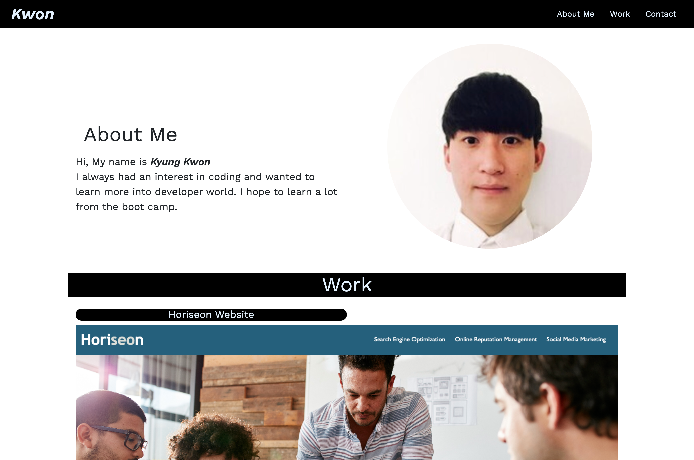

# About the Project

This is the first portfolio website for U of U boot camp project. The project is a fully functional responsive website.

# Project Includes

    - Topnav position fixed on top of the website

    - Collapsable menu appears on smaller screens

    - Three seperate sections featuring About, Work, and Contact

    - Images redirecting to the link on a new tab

    - Topnav items scrolls to the according section

# Built with

HTML, CSS, Bootstrap CSS and Icon

[View live](https://kyungkwon01.github.io/boot-camp-portfolio/)
